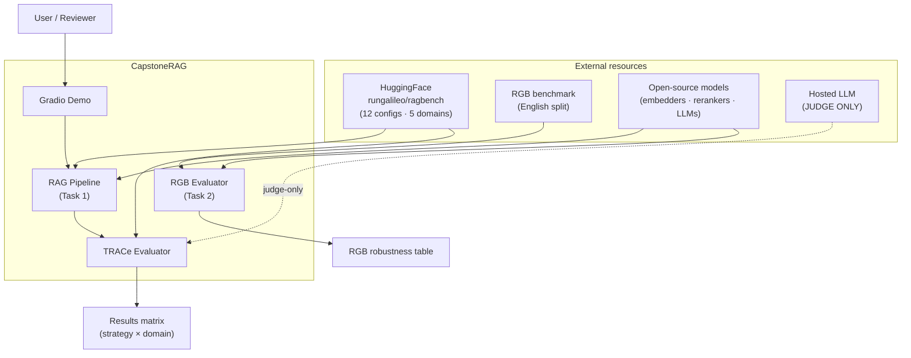
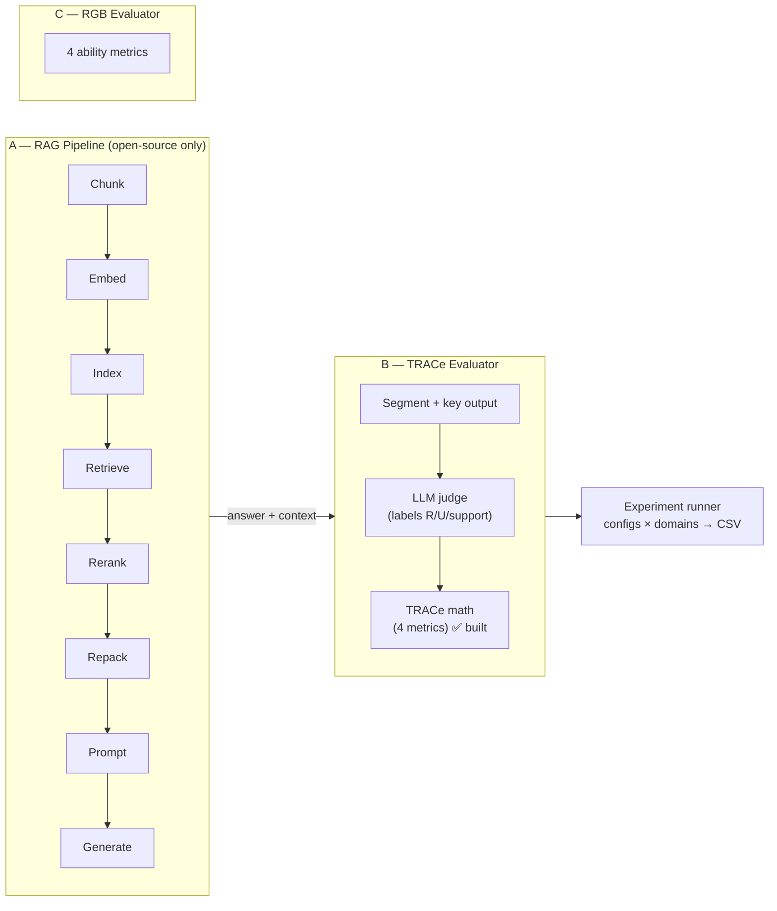
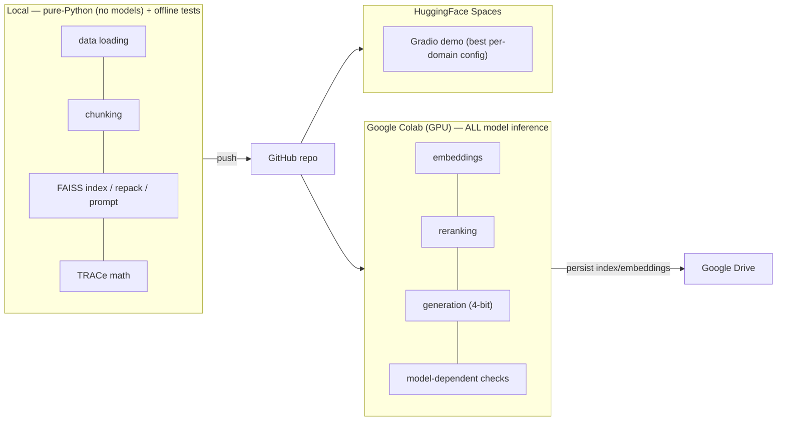

# High-Level Design (HLD) — CapstoneRAG

**Project:** Real-World RAG System (Group 16, AI/ML PGCP capstone)
**Status:** living document · last updated 2026-06-06
**Scope:** the *what* and *why* of the system. Implementer-level detail (interfaces, schemas,
sequences) lives in [`LLD.md`](./LLD.md).

---

## 1. Purpose

Retrieval-Augmented Generation (RAG) grounds an LLM's answers in retrieved documents to reduce
hallucination and stale knowledge. This project builds a **modular, domain-aware RAG pipeline** and —
more importantly — a **self-implemented evaluation suite**, because rigorous evaluation and analysis
is the graded core of the capstone, not the pipeline itself.

The system addresses two tasks:

- **Task 1 — RAGBench.** A configurable RAG pipeline over 5 industry domains, evaluated per component
  with the **TRACe** metrics (Context **R**elevance, Context **U**tilization → "uTilization",
  **A**dherence, **C**ompleteness), compared against the dataset's reference scores. Headline output:
  a **strategy × domain results matrix** plus analysis of what works where, and why.
- **Task 2 — RGB.** Generation-robustness evaluation of several open-source LLMs across 4 abilities:
  noise robustness, negative rejection, information integration, counterfactual robustness.

## 2. Goals and non-goals

| | |
|---|---|
| **Goals** | Self-implement TRACe from the paper's definitions; validate it against reference scores; cover all 5 domains via **one** configurable pipeline; run controlled one-component-at-a-time ablations; evaluate 4–5 open-source LLMs on RGB; ship a live demo. |
| **Non-goals** | No LLM fine-tuning (bonus only). No production-grade deployment (a basic demo suffices). No use of off-the-shelf evaluation libraries as the primary evaluator (RAGAS only as an optional sanity cross-check). |

## 3. Hard constraints (drive every design decision)

1. **Open-source models only** for retrieval, embeddings, and generation.
2. **A hosted/closed LLM (e.g. OpenAI) is allowed *only* as an evaluation judge** — never for
   generation or retrieval.
3. **Metrics implemented by us** from the papers' formulas.
4. **Compute = Google Colab** (free / Pro); design around a single mid-tier GPU. **All model inference
   (embedder, reranker, generator) runs on Colab — a runtime constraint means models are not run locally.**
   Pure-Python work (data loading, chunking, indexing, repacking, prompting, the TRACe arithmetic) and all
   offline tests run locally; model-dependent checks run on Colab via a runner notebook.
5. **All 5 domains** covered by one config-driven pipeline.
6. **Split discipline:** tune on validation, report final numbers on test, never tune on test.
7. **A live demo is mandatory** at the final presentation.

## 4. System context

## 5. High-level architecture

The system has **three subsystems** that meet at evaluation time:

**Why this shape:**
- **One pipeline, many configs.** Each stage is a swappable component selected by a config; an
  "experiment" is just a config. Looping configs × domains produces the required results matrix.
- **Evaluator is independent of the pipeline.** It scores *any* (question, context, answer) triple,
  whether from RAGBench's reference data (for validation) or from our own pipeline (for experiments).
- **The judge is isolated** behind one component so the open-source-only rule is never violated
  elsewhere, and so the system runs end-to-end without a judge key (judge plugs in last).

## 6. Major components (overview — see LLD §3 for interfaces)

| Component | Responsibility | Status |
|---|---|---|
| **Data loader** | Load a RAGBench domain/split; map domain → config; optional sampling | ✅ **built** (brick 1) |
| **Chunker** | Slice documents into retrievable pieces | ✅ **built** (brick 2; fixed + noop) |
| **Registry** | Swap components by config string (`@register` + `build`) | ✅ **built** (brick 2) |
| **Embedder** | Encode text → dense vectors | ✅ **built** (brick 3; sentence-transformers) |
| **Index** | Store/search vectors; **per-example or pooled-corpus** mode | ✅ **built** (brick 4; FAISS exact) |
| **Retriever** | Dense / sparse / hybrid (RRF) candidate retrieval | ✅ **built** (brick 4; dense — sparse/hybrid later) |
| **Reranker** | Re-order candidates (cross-encoder / monoT5) | ✅ **built** (brick 5; cross-encoder + noop) |
| **Repacker** | Order chunks in the prompt (forward / reverse / sides) | ✅ **built** (brick 5) |
| **PromptBuilder** | Assemble the grounding prompt (biggest Adherence lever) | ✅ **built** (brick 6; grounded + minimal) |
| **Generator** | Open-source LLM answer generation (4-bit on Colab) | ✅ **built** (brick 7; hf for Colab + echo for tests) |
| **OutputSegmenter** | Split our context+answer into keyed sentences for the judge | ✅ **built** (brick 8; regex + nltk splitters) |
| **Pipeline + Runner** | Assemble components from config; loop configs × domains | ✅ **built** (brick 9; config + pipeline + runner) |
| **TRACe math** | The 4 metrics from sentence labels | ✅ **built & validated** |
| **TRACe judge** | Produce R/U/support labels for our pipeline's answers | deferred (needs key) |
| **RGB evaluator** | The 4 robustness-ability metrics | planned (Phase 3) |
| **Demo** | Gradio app: domain → query → answer + sources | planned (Phase 4) |

Optional (interfaces now, implementations after Review #1): **QueryTransform** (HyDE / decomposition),
**Summarizer** (context compression). *Query classification* is intentionally dropped — RAGBench always
retrieves and always ships a document list, so it adds nothing here.

## 7. Data flow

**Offline (index build):** documents → chunk → embed → index (persisted to Drive to avoid recompute).

**Online (answer a query):** query → [transform] → retrieve → rerank → repack → [summarize] → build
prompt → generate → return `{answer, sources, context}`.

**Evaluation:** `{question, context, answer}` → segment into keyed sentences → judge labels relevant
(R) / utilized (U) / support → TRACe math → 4 scores → logged with the config to the results matrix.

## 8. Evaluation strategy (the graded core)

TRACe defines four metrics. With `Len()` in **sentences**:

| Metric | Formula | Diagnoses |
|---|---|---|
| Context Relevance | `|R| / T` | retriever (is retrieved context on-topic?) |
| Context Utilization | `|U| / T` | generator/prompt (how much context was used?) |
| Completeness | `|R ∩ U| / |R|` | answer coverage (did it use the relevant info?) |
| Adherence | all response sentences grounded? (bool) | hallucination / faithfulness |

`T` = total document sentences; `R` = relevant sentence keys; `U` = utilized sentence keys.

**Two-stage validation strategy** (de-risks the most important deliverable):
1. **Arithmetic half** (no LLM) — proven during EDA to reproduce RAGBench's shipped reference scores
   **exactly** (RMSE = 0 on all 12 configs; adherence 100%). ✅ Done.
2. **Judge half** (LLM, judge-only) — produces the R/U/support labels for *our* pipeline's outputs;
   validated against shipped labels before we trust any experiment number. Deferred until a key exists.

This split means the math is provably correct *before* any model is involved, and the judge is the
only place subjective error can enter — so that's where validation effort concentrates.

## 9. Technology choices (rationale in LLD §8)

| Layer | Default | Notes |
|---|---|---|
| Data | HF `datasets` → `rungalileo/ragbench` | official source |
| Chunking | fixed 512/50 baseline | compare PGC, DFC, sentence-group (domain-dependent) |
| Embeddings | `BAAI/bge-base-en-v1.5` | MiniLM for fast iteration; all embedding runs on Colab (per constraint) |
| Vector store | FAISS / ChromaDB | local, simple |
| Sparse / fusion | `rank-bm25` + RRF | for hybrid retrieval |
| Reranker | cross-encoder MiniLM / monoT5 | |
| Generator | Qwen2.5-7B / Llama-3.1-8B (4-bit) | Qwen2.5-3B for fast dev |
| Judge | hosted LLM, judge-only | cached; deferred until key available |
| Demo | Gradio | |

## 10. Domain-awareness (why "one pipeline" still adapts per domain)

EDA showed the best configuration is domain-dependent. Notably, **chunking is a real lever in only 3 of
12 sub-datasets** (long-document corpora: legal contracts, and two support/knowledge sets); the other 8
ship pre-segmented short passages where chunking barely moves the metrics. The pipeline therefore reads
a **per-domain config**, and the analysis explicitly reports where each lever does and does not help.

## 11. Deployment view

## 12. Cross-cutting concerns

- **Reproducibility:** fixed seeds; every run logs its resolved config + scores to CSV; configs are
  declarative YAML artifacts.
- **Cost control (judge):** cache judge outputs (hash of inputs → JSON); evaluate on subsets during
  iteration, full test sets only for final numbers.
- **Compute limits:** persist embeddings/indexes to Drive; 4-bit generators; small models for dev.
- **Split discipline:** validation for tuning, test for final numbers.
- **Privacy:** the public repo carries no personal data; the team-internal handoff doc is local-only.

## 13. Key risks

| Risk | Mitigation |
|---|---|
| Evaluator incorrectness (highest impact) | Validate against reference scores before any ablation — done for the math half. |
| Compute/time (small team, weekends) | Limit ablation depth; full grid on 1–2 domains, reduced grid elsewhere. |
| Open-source generator quality on RGB | Expect lower rejection/counterfactual scores — that is itself a reportable finding. |
| Judge cost/latency | Cache + subset-first. |
| Dataset scale | Subset-then-scale; strict splits. |

---

*Companion document: [`LLD.md`](./LLD.md) — module interfaces, config schema, sequence diagrams.*
