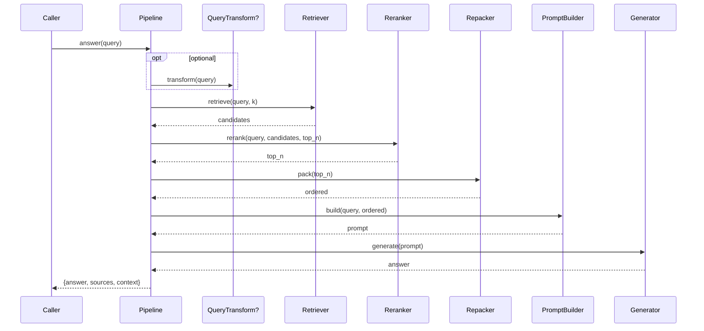
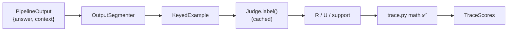
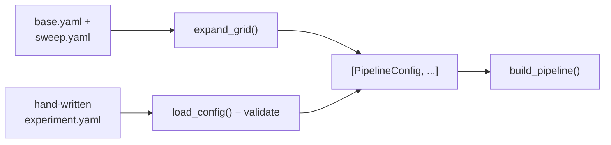

# Low-Level Design (LLD) — CapstoneRAG

**Companion to:** [`HLD.md`](./HLD.md) (system-level *what/why*). This document is the *how*.
**Status:** living document · last updated 2026-06-06.

> ⚠️ **Design intent, not frozen contract.** Interfaces below are the planned shape; signatures and
> data structures may be refined during implementation. The TRACe math module (§5) is the exception —
> it is **built and validated** and reflects real code.

---

## 1. Module map

```
src/
├── data_loader.py        # load_domain(); domain → config map; sampling
├── chunking/             # one file per strategy (CONVENTION for multi-impl components)
│   ├── base.py           #   Chunk dataclass + Chunker interface + helpers
│   ├── fixed_chunker.py  #   FixedChunker (baseline)  [type "fixed"]
│   ├── noop_chunker.py   #   NoOpChunker (no-chunking) [type "none"]
│   └── __init__.py       #   re-exports + imports each strategy so it registers
├── embeddings/           # Embedder interface + one file per model impl
│   ├── base.py           #   Embedder interface
│   ├── sentence_transformer_embedder.py  # any sentence-transformers model [types "sentence_transformer"/"minilm"]
│   └── __init__.py       #   load_embedders() lazily registers (keeps torch out of `import src`)
├── indexing/             # ✅ Index backends (package, per convention)
│   ├── base.py           #   Index interface + RetrievedChunk result type
│   ├── faiss_index.py    #   FaissIndex (exact IP); per-example | pooled mode [type "faiss"]
│   └── __init__.py       #   re-exports + registers (faiss imported lazily → light)
├── retrieval/            # ✅ Retriever strategies (package, per convention)
│   ├── base.py           #   Retriever interface
│   ├── dense_retriever.py #  DenseRetriever (text→nearest chunks) [type "dense"]
│   └── __init__.py       #   re-exports + registers; sparse/hybrid = sibling files later
├── reranking/            # ✅ Reranker strategies (package)
│   ├── base.py           #   Reranker interface
│   ├── noop_reranker.py  #   NoOpReranker [type "none"] — light control arm
│   ├── cross_encoder_reranker.py  # CrossEncoderReranker [type "cross_encoder"] — heavy (torch)
│   └── __init__.py       #   registers noop on import; load_rerankers() for the cross-encoder
├── repacking/            # ✅ Repacker strategies (package, one file per strategy)
│   ├── base.py           #   Repacker interface
│   ├── forward_repacker.py #  ForwardRepacker [type "forward"]
│   ├── reverse_repacker.py #  ReverseRepacker [type "reverse"]
│   ├── sides_repacker.py  #  SidesRepacker   [type "sides"]
│   └── __init__.py       #   re-exports + registers (pure Python, light)
├── prompt.py             # PromptBuilder: grounding prompt templates
├── generator.py          # Generator: open-source LLM (+ StubGenerator for local)
├── segment.py            # OutputSegmenter: context+answer → keyed sentences
├── query.py              # (optional) QueryTransform: HyDE / decomposition
├── summarizer.py         # (optional) Summarizer: context compression
├── registry.py           # type-string → class registry + @register decorator
├── config_schema.py      # typed schema; validates loaded YAML (fail-fast)
├── config.py             # load_config(yaml) → validated objects; grid generator
├── pipeline.py           # Pipeline.answer(): assemble + run the components
├── runner.py             # ExperimentRunner: loop configs × domains → CSV
└── evaluator/
    ├── trace.py          # ✅ 4 TRACe metrics from labels (BUILT)
    ├── validate.py       # ✅ validate vs reference scores (BUILT)
    ├── judge.py          # LLM judge (deferred; needs key)
    └── rgb.py            # RGB 4-ability metrics (Phase 3)
```

> **Convention — one file per strategy for multi-implementation components.** Any component expected to
> grow several swappable strategies (chunker, embedder, index, retriever, reranker) is a *package* **from the
> start — even when only one implementation exists yet** (don't defer it to "when the 2nd strategy lands"): a
> `base.py` holding the shared interface + data structures, one file per concrete strategy, and an `__init__.py`
> that re-exports the contract and imports each strategy file so its `@register` decorator runs. Every such
> component MUST define its interface in `base.py` (e.g. `Index`, `Retriever`) — an implementation without a
> declared interface is a convention violation. Benefits:
> teammates add a strategy by dropping in a new file + one import line (no merge conflicts on a shared file),
> and each strategy is self-contained and readable. **File naming:** descriptive snake_case carrying the
> component noun — `fixed_chunker.py`, `noop_chunker.py`, later `pgc_chunker.py` (PEP 8: modules lowercase;
> NOT `FixedChunker.py`). Single-implementation components (e.g. `data_loader.py`, `repacker.py`) stay flat
> files until they need to grow. ⚠️ The `__init__.py` imports are **required** — a
> strategy whose file is never imported never registers (decorators only run on import).

## 2. Core data structures

```python
@dataclass(frozen=True)
class Chunk:
    text: str
    doc_id: str            # which source document
    chunk_id: str          # unique within the index
    meta: dict             # domain, char span, parent id (for small2big), etc.

@dataclass(frozen=True)
class RetrievedChunk:
    chunk: Chunk
    score: float
    rank: int

@dataclass(frozen=True)
class PipelineOutput:
    answer: str
    sources: list[RetrievedChunk]   # what was retrieved (post-rerank/repack)
    context: str                    # exact context string given to the generator

# Bridge to the evaluator — mirrors RAGBench's reference schema (see §6).
@dataclass(frozen=True)
class KeyedExample:
    question: str
    documents_sentences: list[list[tuple[str, str]]]  # [doc][sent] -> ("0a", text)
    response_sentences: list[tuple[str, str]]         # [("a", text), ...]

@dataclass(frozen=True)
class TraceScores:
    relevance: float
    utilization: float
    completeness: float
    adherence: bool
```

## 3. Component interfaces (design intent)

Each is a small class registered under a `type` string (see §7). One baseline implementation first;
variants added for ablations.

```python
class Chunker(Protocol):
    def chunk(self, documents: list[str], *, doc_ids: list[str]) -> list[Chunk]: ...
    # FixedChunker(size=512, overlap=50). Later: PGC, DFC, SentenceGroup, Semantic.

class Embedder(Protocol):
    def embed(self, texts: list[str]) -> "np.ndarray": ...   # (n, d) float32
    @property
    def dim(self) -> int: ...

class Index(Protocol):
    # corpus mode set at build time: "per_example" or "pooled" (per-domain corpus)
    def build(self, chunks: list[Chunk], vectors: "np.ndarray") -> None: ...
    def search(self, query_vec: "np.ndarray", k: int) -> list[RetrievedChunk]: ...
    def persist(self, path: str) -> None: ...      # save to Drive
    @classmethod
    def load(cls, path: str) -> "Index": ...

class Retriever(Protocol):
    # wraps an Index; "dense" | "sparse"(BM25) | "hybrid"(RRF over both)
    def retrieve(self, query: str, k: int) -> list[RetrievedChunk]: ...

class Reranker(Protocol):
    def rerank(self, query: str, chunks: list[RetrievedChunk], top_n: int) -> list[RetrievedChunk]: ...
    # NoOpReranker for the "rerank: off" ablation arm.

class Repacker(Protocol):
    def pack(self, chunks: list[RetrievedChunk]) -> list[RetrievedChunk]: ...
    # forward | reverse (most-relevant last; mitigates lost-in-the-middle) | sides

class PromptBuilder(Protocol):
    def build(self, query: str, chunks: list[RetrievedChunk]) -> str: ...
    # grounding instruction + context formatting. The biggest Adherence lever — kept swappable.

class Generator(Protocol):
    def generate(self, prompt: str) -> str: ...
    # OSS LLM (4-bit, Colab). StubGenerator(echo/templated) lets the belt run locally with no GPU.

class OutputSegmenter(Protocol):
    def keyed(self, context_chunks: list[RetrievedChunk], answer: str) -> KeyedExample: ...
    # produces "0a"/"1b" doc-sentence keys and "a"/"b" response keys (RAGBench scheme, §6).
```

## 4. Pipeline assembly & flow

```python
class Pipeline:
    def __init__(self, cfg: PipelineConfig): ...   # built via factory from validated config
    def index_domain(self, domain: str, split: str) -> None: ...   # offline: chunk→embed→index
    def answer(self, query: str) -> PipelineOutput: ...            # online (below)
```



## 5. TRACe evaluator — BUILT (real code, validated)

```python
# src/evaluator/trace.py
def total_doc_sentences(documents_sentences) -> int          # T
def relevance(relevant_keys, total_sentences) -> float       # |R| / T   (LIST length, no dedup)
def utilization(utilized_keys, total_sentences) -> float     # |U| / T
def completeness(relevant_keys, utilized_keys) -> float      # |R∩U| / |R|;  |R|==0 -> 1.0
def adherence(unsupported_response_sentence_keys) -> bool    # == (list is empty)
def score_from_reference_labels(example) -> dict             # all 4, from gold labels

# src/evaluator/validate.py
def rmse(ours, theirs) -> float
def validate_config(config, n=300) -> dict                   # RMSE/exact for fractions, acc for adherence
def validate_all(n=300) -> list[dict]                        # all 12 configs across 5 domains
```

**Critical implementation rules (learned from EDA — see HLD §8):**
- **List semantics, not set:** count R and U by raw `len(list)` to match how RAGBench computed the
  reference scores; compute `R ∩ U` as sets. Deduping R/U introduces a small systematic error.
- **`|R| == 0` → completeness = 1.0** (frequent in the legal corpus; matches reference).
- **Adherence = `len(unsupported_response_sentence_keys) == 0`.** Do *not* derive it from per-sentence
  `fully_supported` flags — those are `None`/blank in most rows (matched reference only ~32%).

**Validation result:** reproduces reference scores exactly — RMSE = 0 on relevance/utilization/
completeness and 100% adherence accuracy across all 12 configs (3,165 examples sampled).

## 6. The judge bridge (deferred — needs key)

The judge produces, for *our* pipeline's output, the same labels RAGBench ships, so the validated math
in §5 can score it unchanged.

```python
# src/evaluator/judge.py  (deferred)
class Judge(Protocol):
    def label(self, keyed: KeyedExample) -> dict: ...
    # returns all_relevant_sentence_keys, all_utilized_sentence_keys,
    #         sentence_support_information, unsupported_response_sentence_keys
```

- Uses the RAGBench Appendix-7.4 labeling prompt; hosted LLM, **judge-only**; temperature 0; JSON mode.
- **Cache:** `hash(keyed_example) → JSON` on disk to control cost and avoid recompute.
- **Validate before trusting:** run on labelled RAGBench examples, compare judge labels/scores to the
  shipped ones (RMSE on the fractions, AUROC/F1 on adherence) until agreement is acceptable.



## 7. Registry & factory

```python
# src/registry.py
REGISTRY: dict[str, dict[str, type]] = {}    # REGISTRY["chunker"]["fixed"] = FixedChunker

def register(kind: str, name: str):
    def deco(cls): REGISTRY.setdefault(kind, {})[name] = cls; return cls
    return deco

# src/pipeline.py
def build_pipeline(cfg: PipelineConfig) -> Pipeline:
    chunker  = REGISTRY["chunker"][cfg.chunker.type](**cfg.chunker.params)
    # ... one lookup per stage; None config → NoOp/skip for optional stages ...
    return Pipeline(...)
```

A `None` value for an optional stage (reranker, summarizer, query transform) wires in a no-op, so the
same assembly code handles "ablate this stage OFF".

## 8. Configuration — YAML source of truth + validation + grid generator

**Decision (see HLD §9 / AI_CONTEXT §11.2):** YAML files are the source of truth (declarative,
git-diffable, double as the demo's per-domain configs). A typed schema validates them on load
(fail-fast on typos / wrong types), and a generator expands sweeps so we author *2 files, not 50*.

```python
# src/config_schema.py
@dataclass(frozen=True)
class StageConfig:
    type: str
    params: dict = field(default_factory=dict)

@dataclass(frozen=True)
class PipelineConfig:
    domain: str
    chunker: StageConfig
    embedder: StageConfig
    index: StageConfig                  # params include corpus: per_example | pooled
    retriever: StageConfig
    reranker: StageConfig | None
    repacker: StageConfig
    summarizer: StageConfig | None
    prompt: StageConfig
    generator: StageConfig
    seed: int = 42

# src/config.py
def load_config(path: str) -> PipelineConfig: ...      # parse + VALIDATE (raise on bad key/type)
def expand_grid(base: str, sweep: str) -> list[PipelineConfig]: ...  # cartesian product
```



Example experiment (`configs/legal_baseline.yaml`):

```yaml
domain: legal
chunker:    { type: fixed,  size: 512, overlap: 50 }
embedder:   { type: bge_base }
index:      { type: faiss, corpus: pooled }
retriever:  { type: hybrid, k: 20 }
reranker:   { type: monoT5, top_n: 5 }   # null to ablate OFF
repacker:   { type: reverse }            # forward | reverse | sides
summarizer: null
prompt:     { type: grounded_v1 }
generator:  { type: qwen2.5-7b, temperature: 0.0 }
```

## 9. Experiment runner (produces the deliverable matrix)

```python
# src/runner.py
def run_experiment(cfg: PipelineConfig, *, n: int) -> dict:
    # index domain (or load cached) → answer n queries → segment → judge → score → aggregate
    # returns one row: {config fields..., mean TRACe scores, n, timestamp}

def run_matrix(configs: list[PipelineConfig], out_csv: str) -> None:
    # loop configs × domains; append rows to CSV; resilient to per-run failure (log + continue)
```

Each row records the **resolved config** (as JSON) alongside its scores, so the results matrix is fully
reproducible and diffable. One component changes at a time across rows — that is what makes the matrix
interpretable.

## 10. RGB evaluator (Task 2 — Phase 3)

```python
# src/evaluator/rgb.py
def noise_robustness(pred, gold) -> bool            # accuracy: gold answer string present in pred
def information_integration(pred, gold) -> bool     # accuracy (multi-part)
def negative_rejection(pred) -> bool                # emitted the instructed refusal string
def error_detection(pred) -> bool                   # flagged "factual errors present"
def error_correction(pred, gold) -> bool            # flagged AND gave the corrected answer
```

Inputs are constructed per RGB's protocol (relevant + noisy docs, etc.) with instruction prompts.
Evaluated over 4–5 open-source LLMs (English split). Metrics are deterministic string checks — no judge.

## 11. Error handling & testing

- **Validation-first:** `load_config` raises on malformed config; the runner catches per-experiment
  failures, logs them, and continues so one bad run does not abort a long grid.
- **Determinism:** seeds fixed; generator temperature 0 for evaluation runs.
- **Unit tests:** the TRACe math is tested by reproducing reference scores (already passing);
  components get small interface tests; the judge gets a label-vs-reference validation harness.
- **Local-first:** `StubGenerator` + small embedders let the whole pipeline run on CPU before any
  Colab/GPU work, so wiring bugs are caught cheaply.

---

*Companion document: [`HLD.md`](./HLD.md) — goals, constraints, system context, deployment.*
